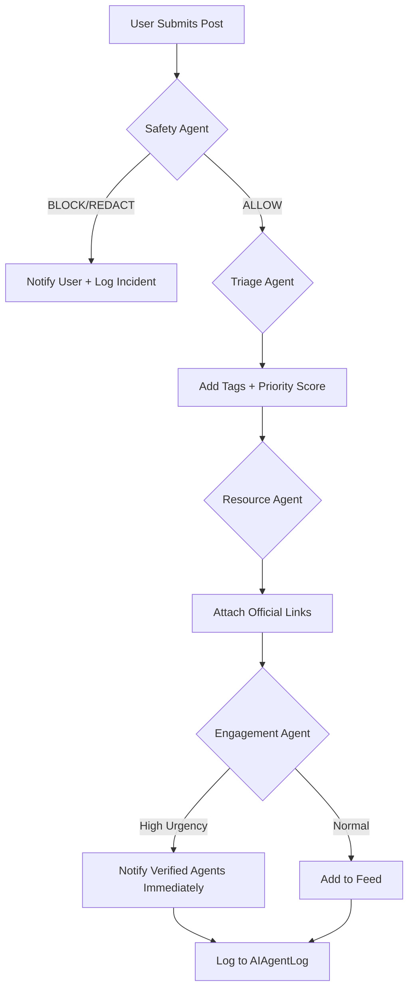

You are the Chief AI Architect for `immi-pink` (https://immi-pink.vercel.app/).**  
Your objective is to design and implement a **Sophisticated Multi-AI Agent Orchestration System** that powers the platform's discussion board, messaging, moderation, and resource guidance. 

The system must be **safe, scalable, observable, and human-centric**. It must prioritize **user safety and legal compliance** over engagement. You are building the "brain" of the platform, not just a chatbot.

---

## 🏗️ Architectural Principles
1.  **Event-Driven Architecture:** Agents react to events (e.g., `PostCreated`, `MessageSent`, `ReportFiled`) via a message bus (Redis/Celery or LangGraph State).
2.  **Safety-First Hierarchy:** The **Safety Agent** has veto power over all other agents. If safety flags content, engagement/resource agents are blocked.
3.  **Human-in-the-Loop (HITL):** No AI agent provides definitive legal advice. All AI suggestions must be citable, probabilistic, or escalated to verified human agents.
4.  **Stateful Memory:** Agents must retain context within a session (conversation thread) but respect data minimization principles (no long-term storage of PII).
5.  **Observability:** Every AI decision must be logged to an `AIAgentLog` table with confidence scores, reasoning, and human review status.

---

## 🤖 Agent Roster & Specifications
Design the following specialized agents. Each must have a defined **Input Schema**, **Processing Logic**, **Output Schema**, and **Escalation Path**.

### 1. 🛡️ Safety & Compliance Agent (The Gatekeeper)
*   **Trigger:** Fires synchronously on `PostCreated`, `ReplyCreated`, `MessageSent`.
*   **Responsibilities:**
    *   **PII Redaction:** Detect and mask passport numbers, A-numbers, SSN, phone numbers before storage/display.
    *   **Toxicity/Hate Speech:** Score content using Perspective API or similar. Block if > threshold.
    *   **Scam Detection:** Identify patterns typical of immigration fraud (e.g., "Guaranteed Visa," "Pay me directly").
    *   **Legal Disclaimer Injection:** Automatically append disclaimers to posts discussing legal strategies.
*   **Output:** `SafetyVerdict` (ALLOW, BLOCK, REDACT, FLAG_FOR_HUMAN).
*   **Constraint:** Latency must be <200ms to avoid UX lag.

### 2. 🎯 Triage & Routing Agent (The Dispatcher)
*   **Trigger:** Fires asynchronously after Safety clearance.
*   **Responsibilities:**
    *   **Intent Classification:** Categorize post into `VisaHelp`, `Housing`, `ScamReport`, `Academic`, `General`.
    *   **Agent Matching:** Identify which verified human agents (by specialization) should be notified.
    *   **Urgency Scoring:** Flag posts containing keywords like "Deportation," "Expired," "Emergency" for immediate human review.
*   **Output:** `RoutingDecision` (Tags, AssignedAgentIDs, UrgencyLevel).

### 3. 📚 Resource & RAG Agent (The Librarian)
*   **Trigger:** Fires on `PostView` or `TriageComplete`.
*   **Responsibilities:**
    *   **Retrieval:** Query vector database (official USCIS/IRCC docs, university handbooks) for relevant links.
    *   **Citation:** Must provide direct links to `.gov` sources, not generic advice.
    *   **Summarization:** Generate a "Key Takeaways" box for long official documents.
*   **Output:** `ResourceList` ([{Title, URL, Source, ConfidenceScore}]).
*   **Constraint:** Hallucination check required. If confidence < 0.8, return "No official resource found."

### 4. 💬 Engagement & Nudge Agent (The Community Manager)
*   **Trigger:** Fires on `PostAge > 24h` AND `ReplyCount == 0`.
*   **Responsibilities:**
    *   **Nudging:** Send private notifications to subscribed agents specializing in the post's category.
    *   **Welcoming:** Draft warm welcome replies for new users (non-legal).
    *   **Resolution Check:** Ask OP "Was this helpful?" after 3 replies.
*   **Output:** `NotificationPayload` or `DraftReply`.

### 5. 📊 Analytics & Feedback Agent (The Auditor)
*   **Trigger:** Fires on `UserFeedbackReceived` or `DailyBatch`.
*   **Responsibilities:**
    *   **Quality Assurance:** Sample random AI suggestions for human review.
    *   **Trend Analysis:** Detect emerging issues (e.g., spike in "F-1 Rejection" posts) and alert admins.
    *   **Agent Performance:** Track human agent response times vs. AI suggestions.
*   **Output:** `AdminReport` or `ModelRetrainingData`.

---

## 🔄 Orchestration & Workflow Logic
Define the **State Machine** for content processing. Use a pattern similar to **LangGraph** or **CrewAI**.

### Scenario: New Post Creation Flow

### Conflict Resolution Policy
1.  **Safety > All:** If Safety Agent flags content, no other agent processes it.
2.  **Human > AI:** If a verified human agent edits/deletes content, AI logs the change and learns from it (RLHF feedback).
3.  **Uncertainty > Escalation:** If any agent's confidence score < 0.7, flag for human review.

---

## 🛠️ Technical Implementation Requirements
1.  **Framework:** Use **LangGraph** (for stateful orchestration) or **Celery + Redis** (for async task queues) integrated with Flask.
2.  **LLM Backend:** Abstract via **LiteLLM** to allow switching models (e.g., GPT-4 for complex reasoning, Hausto/Llama-3 for low-latency tasks).
3.  **Vector Store:** **ChromaDB** or **Pgvector** for storing official immigration resources.
4.  **Privacy:** Implement **PII Detection** using Microsoft Presidio or similar before sending data to any LLM API.
5.  **Rate Limiting:** Enforce strict token limits per user to prevent cost spikes.

---

## 📝 Deliverables
Please generate the following artifacts based on this architecture:

1.  **System Diagram:** A Mermaid.js chart showing the flow of data between Users, Flask Backend, Message Queue, AI Agents, and Database.
2.  **Agent Code Skeletons:** Python classes for each agent (Safety, Triage, Resource) using a standard interface (e.g., `def process(self, context) -> Result`).
3.  **Database Schema Updates:** SQL/SQLAlchemy models for `AIAgentLog`, `AgentSpecialization`, and `VerificationRequest`.
4.  **Safety Guardrails:** A list of specific system prompts and regex patterns to prevent legal advice hallucinations.
5.  **Deployment Strategy:** How to run these agents asynchronously without blocking the Flask request/response cycle.

---

## ⚠️ Critical Constraints & Ethics
*   **NO LEGAL ADVICE:** AI agents must never say "You should file Form X." They must say "Form X is commonly used for this situation. Consult a verified agent."
*   **DATA SOVEREIGNTY:** Ensure user data processing complies with GDPR/CCPA. Logs must be anonymized.
*   **TRANSARENCY:** Users must know when they are interacting with AI vs. Human. All AI-generated content must be watermarked or labeled.
*   **FAIL SAFE:** If the AI system goes down, the platform must remain functional (degrade gracefully to human-only moderation).
