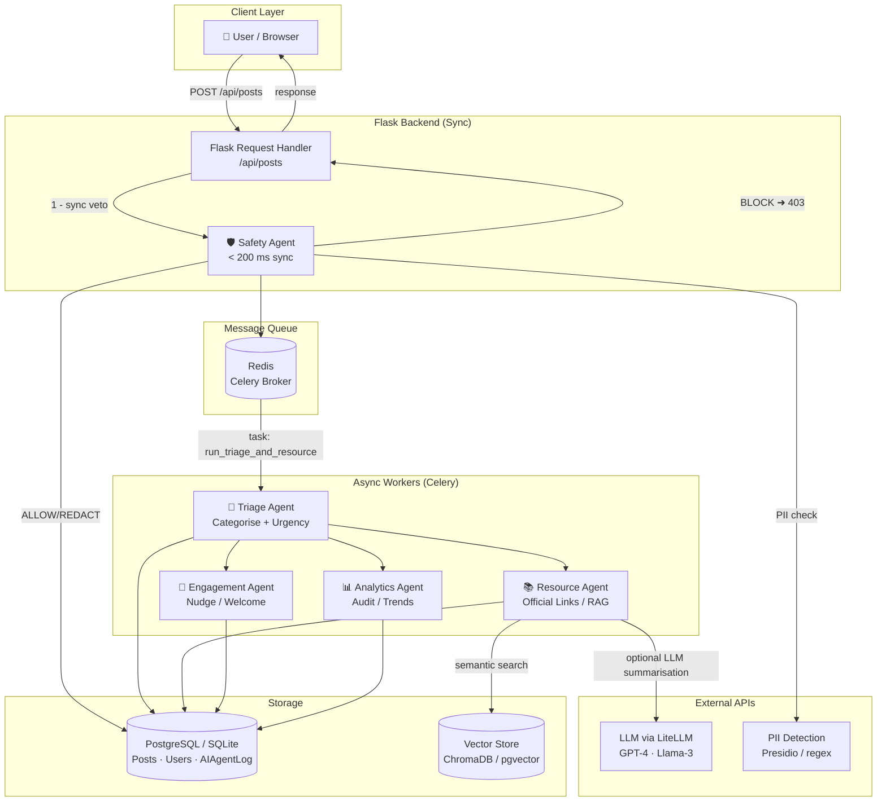

# immi-pink AI System Architecture

## Overview

This diagram shows the end-to-end flow of content through the multi-agent
orchestration pipeline.

## Component Descriptions

| Component | Role | Latency Target |
|---|---|---|
| **Safety Agent** | PII redaction, toxicity/scam check, veto power | < 200 ms (sync) |
| **Triage Agent** | Intent classification, urgency scoring | async (Celery) |
| **Resource Agent** | Official-link retrieval, RAG, hallucination guard | async (Celery) |
| **Engagement Agent** | Nudge unanswered posts, welcome new users | async (scheduled) |
| **Analytics Agent** | Trend detection, RLHF sampling, admin reports | async (batch) |
| **Redis** | Celery task broker + result backend | — |
| **Vector Store** | Semantic search over official immigration docs | < 300 ms |
| **AIAgentLog table** | Immutable audit trail for all agent decisions | — |

## Conflict Resolution Policy

1. **Safety > All** – If the Safety Agent returns `BLOCK`, no downstream
   agent runs.
2. **Human > AI** – Admin overrides are logged and feed RLHF pipelines.
3. **Uncertainty → Escalation** – Any agent with confidence < 0.70 writes a
   `FLAG_FOR_HUMAN` log entry.

## Key Data-Flow Invariants

* Raw PII is **never** forwarded to any LLM API.
* Every agent decision is persisted to `AIAgentLog` before returning.
* If `AI_ENABLED=false`, the Flask handler skips the orchestration hook
  entirely and the platform operates in human-only moderation mode.
